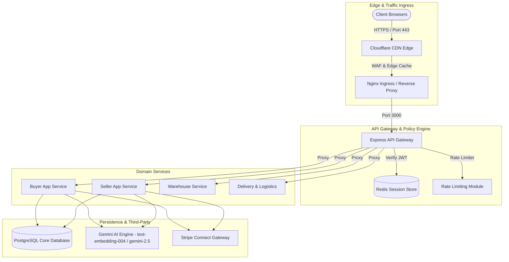
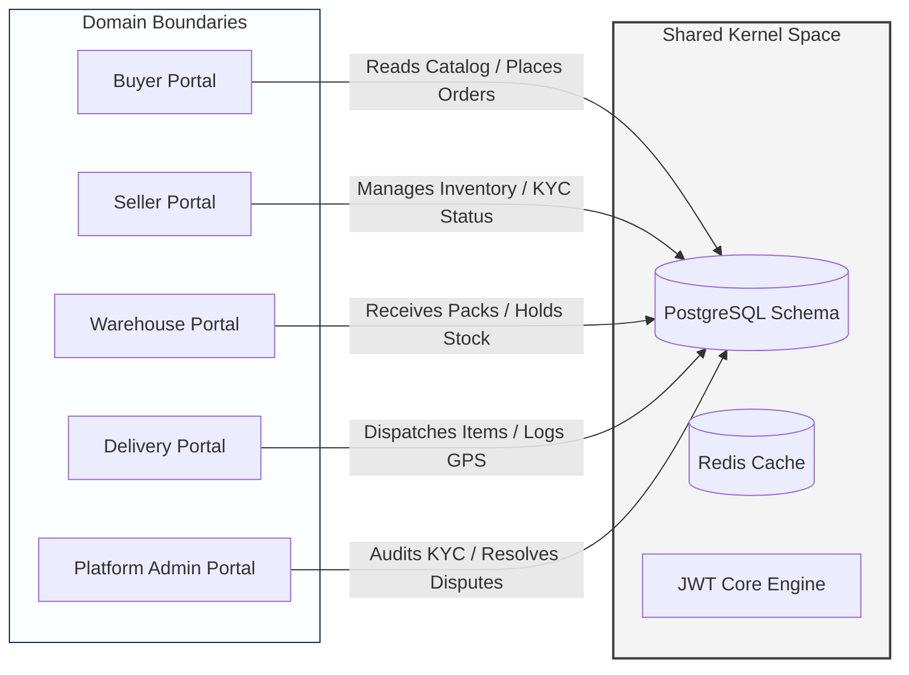
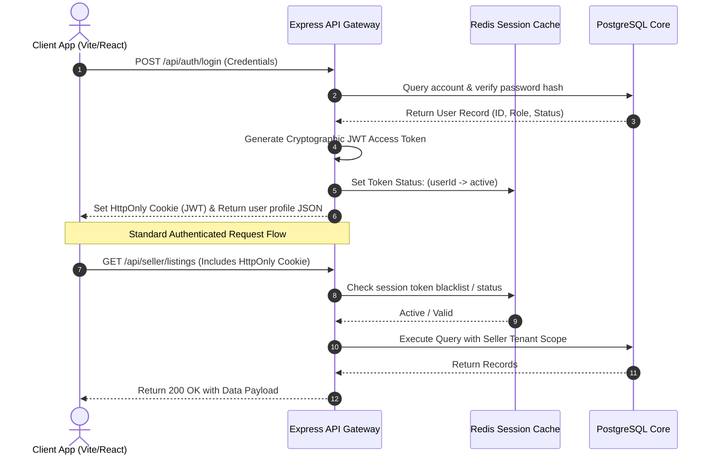
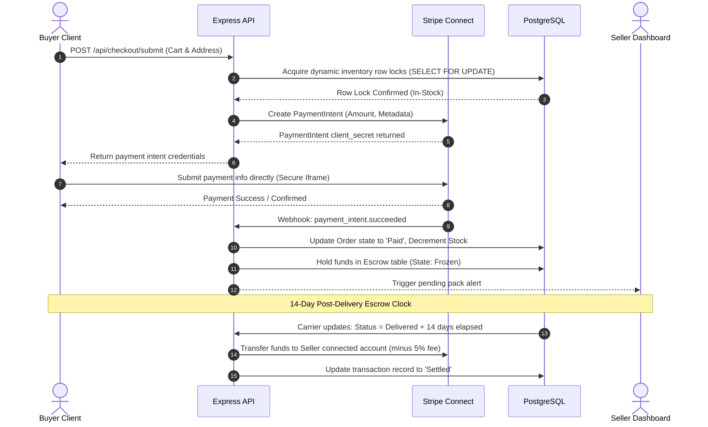
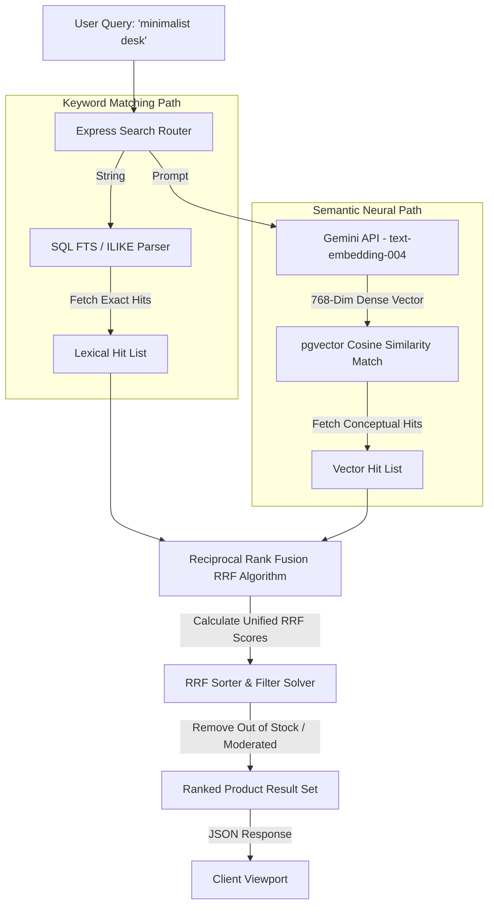
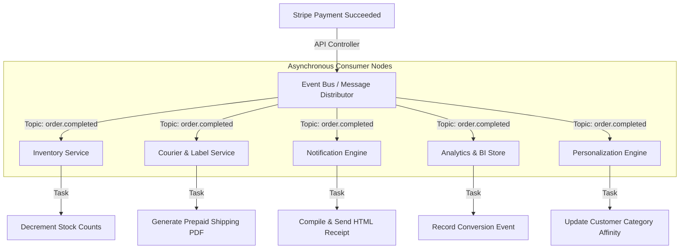
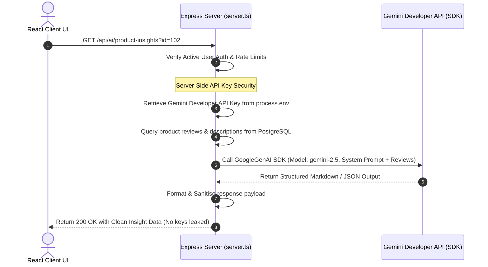
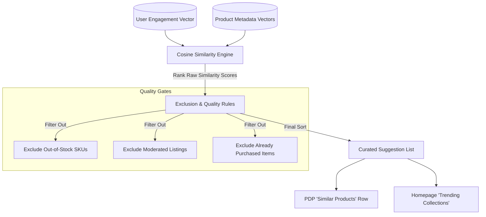

```mermaid
graph LR
    Push[Git Push to main] --> Lint[Linter Run: npm run lint]
    Lint --> Compile[TypeScript Compiler: npm run build]
    Compile --> Test[Unit & Integration Tests: npm run test]
    Test -->|Pass| Docker[Docker Container Build]
    Docker -->|Publish| Artifacts[Cloud Artifact Registry]
    Artifacts -->|Deploy| CloudRun[Cloud Run Container]
    CloudRun -->|Ingress Config| Nginx[Nginx Edge Ingress]
```

# Ocean: Core Architecture Diagrams v1.0
## Visual Representation of Pipelines, Lifecycle Sequences, and Topology

This document compiles the visual architecture specs, sequence graphs, and component boundary models for Ocean's engineering suite. It serves as the single source of truth for our technical workflows, providing both high-fidelity text-based ASCII and standard Mermaid.js layout structures.

---

## 1. Overall System Architecture

The overall system architecture details how edge traffic passes through the CDN layer and Ingress Controller into our micro-architected Gateway, routing queries to proper domain-driven handlers.

### Mermaid Diagram


### ASCII Schematic
```
  [ Client Browsers ]
          │ (HTTPS - Port 443)
          ▼
┌───────────────────┐
│  Cloudflare CDN   │ ◄─── WAF & Static Asset Edge Caching
└─────────┬─────────┘
          │
          ▼
┌───────────────────┐
│   Nginx Ingress   │ ◄─── SSL Termination & Request Proxying
└─────────┬─────────┘
          │ (Forward to Port 3000)
          ▼
┌───────────────────┐
│ Express Gateway   │ ◄─── Token Verification, Route Security, Rate Limiting
└────┬─────┬─────┬──┘
     │     │     │
     │     │     └────────────────────────┐
     ▼     ▼                              ▼
┌────────┐┌────────┐                ┌────────────┐
│ Buyer  ││ Seller │                │ Logistics  │ ◄── Domain-Driven Services
│ Service││ Service│                │ & Delivery │
└───┬────┘└───┬────┘                └─────┬──────┘
    │         │                           │
    └─────────┼───────────────┬───────────┘
              ▼               ▼
     ┌────────────────┐ ┌─────────────┐
     │ PostgreSQL DB  │ │  Redis      │ ◄── Storage & High-Speed Cache Core
     └────────────────┘ └─────────────┘
```

---

## 2. Service Boundaries & Multi-Vendor Layout

Ocean is structured as a multi-tenant, micro-modular monolith. Boundaries between services are enforced at the router and directory levels, communicating via clean service-layer abstractions and database transactions.

### Mermaid Diagram


---

## 3. End-to-End Authentication Flow

Ocean maintains a stateless OAuth/JWT verification sequence. Session profiles are validated dynamically on the server side using lazy Redis validation to protect client-side environments from unauthorized data leakages.

### Mermaid Diagram


---

## 4. Checkout & Financial Escrow Sequence

To ensure payment integrity and customer security, financial transactions are executed via Stripe Connect. Funds are locked in escrow for 14 calendar days after delivery verification before settlement is dispatched.

### Mermaid Diagram


---

## 5. Lexical & Vector Hybrid Search Pipeline (RRF)

Our search architecture utilizes Reciprocal Rank Fusion (RRF) to merge exact keyword hits with high-fidelity semantic embeddings generated via the Gemini `text-embedding-004` API.

### Mermaid Diagram


---

## 6. Decoupled Asynchronous Event Bus Flow

To maximize system throughput and isolate critical systems, order events are dispatched asynchronously. Domain subscribers react independently to finalize logistics, update analytical funnels, and trigger emails.

### Mermaid Diagram


---

## 7. Server-Side AI Request Lifecycle

AI requests are strictly kept on the server to protect secret keys. The `gemini-2.5` model generates smart insights, summaries, and categorizations behind an Express proxy layer.

### Mermaid Diagram


---

## 8. Content-Based Recommendation Pipeline

Recommendations are driven by mapping product features (materials, colors, categories, price points) against real-time user engagement behaviors (browses, cart additions, and historical orders) to compile highly personalized suggestions.

### Mermaid Diagram


---

## 9. Production CI/CD & Deployment Pipeline

Every merge into `main` executes automatic linters, TypeScript compiler tests, and unit testing runs. Upon success, an isolated container is built and deployed directly to Cloud Run behind Nginx.

### Mermaid Diagram


---

## 10. Database Entity Relationship Diagram (ERD)

The persistent database schema is designed for tight referential integrity, strong primary/foreign key cascading, and operational trace logs to map out marketplace participants.

### Mermaid Diagram
```mermaid
erDiagram
    USERS {
        uuid id PK
        string email UNIQUE
        string password_hash
        string role
        string status
        timestamp created_at
    }
    SELLERS {
        uuid id PK
        uuid user_id FK
        string brand_name
        string tax_id
        string kyc_status
        timestamp registered_at
    }
    PRODUCTS {
        uuid id PK
        uuid seller_id FK
        string title
        string description
        string category
        decimal price
        integer stock_quantity
        string status
        timestamp created_at
    }
    ORDERS {
        uuid id PK
        uuid buyer_id FK
        decimal total_amount
        string status
        timestamp created_at
    }
    ORDER_ITEMS {
        uuid id PK
        uuid order_id FK
        uuid product_id FK
        integer quantity
        decimal unit_price
    }

    USERS ||--o| SELLERS : "has_profile"
    SELLERS ||--o{ PRODUCTS : "owns"
    USERS ||--o{ ORDERS : "places"
    ORDERS ||--|{ ORDER_ITEMS : "contains"
    PRODUCTS ||--o{ ORDER_ITEMS : "included_in"
```
